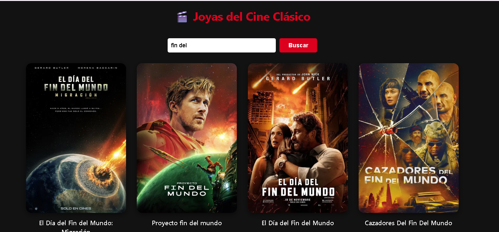

# 🎬 Classic Movie Explorer

Una aplicación web sencilla y elegante para explorar joyas del cine clásico utilizando la API de **The Movie Database (TMDB)**. Este proyecto fue diseñado para practicar el consumo de APIs, manejo de asincronía y paginación con JavaScript puro.

![Vista previa del proyecto]

## 🚀 Características
- **Conexión a API Real:** Obtención de datos dinámicos desde TMDB.
- **Paginación Funcional:** Navegación por diferentes páginas de resultados (12 películas por vista).
- **Buscador Dinámico:** Filtra películas por título en tiempo real.
- **Diseño Responsivo:** Interfaz adaptada a móviles y escritorio mediante CSS Grid.
- **Seguridad Básica:** Estructura preparada para el manejo de variables de entorno.

## 🛠️ Tecnologías utilizadas
- **HTML5** (Estructura semántica)
- **CSS3** (Grid Layout, Flexbox y animaciones)
- **JavaScript (Vanilla)** (Fetch API, Async/Await, DOM Manipulation)
- **TMDB API** (Fuente de datos)

## ⚙️ Instalación y Configuración local

Si deseas clonar este proyecto y ejecutarlo en tu máquina:

1. **Clona el repositorio:**
   ```bash
   git clone [https://github.com/CarmenVar/practicasAPImovies.git]